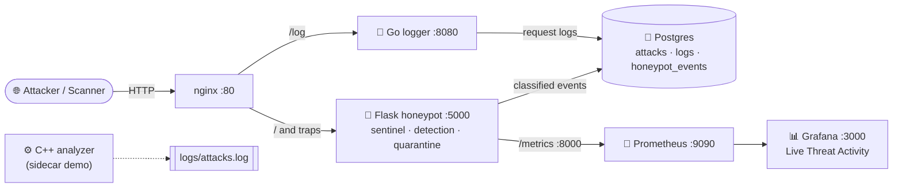
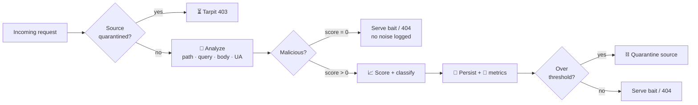

<div align="center">


# 🐉 DracoLure

**Dragon Vector Honeypot** — a polyglot deception honeypot that lures attackers, classifies every probe the instant it lands, scores the threat, and quarantines hostile sources — all in real time.

<!-- Status -->
[](https://github.com/kiurakku/DracoLure/actions/workflows/build-and-test.yml)


<!-- Stack -->


**Connect:** [](https://github.com/kiurakku) [](https://t.me/SyntacticSugar) [](mailto:yanginero@outlook.com)

</div>

---

## 🎯 What it does

This is **not** a passive log sink. The moment a request touches the honeypot, a purpose-built sentinel runs on it — before any route executes:

1. 🪤 **Deceives** — serves believable bait (a fake corporate portal, a fake `/.env`, fake `wp-login`, `phpMyAdmin`, `/.git/config`) so an attacker keeps interacting instead of leaving.
2. 🔬 **Detects** — matches the request against a signature library (SQLi, XSS, path traversal, RCE, Log4Shell, webshells, template injection, scanners) with **URL-decode normalization** so encoded payloads can't slip past.
3. 📈 **Scores** — assigns a 0–100 threat score and a severity band (`low → critical`) to every interaction.
4. ⛓️ **Quarantines** — when a source crosses the threat threshold it is **auto-blocked** and tarpitted: it stops receiving bait and gets slowed 403s. *Self-contained and defensive — the honeypot only changes how it answers its own traffic; it never touches the attacker's host.*
5. 📊 **Observes** — every event flows to Postgres and to Prometheus, and a live Grafana dashboard shows the picture as it happens.

> ⚠️ **Ethics & scope.** This is a **defensive** research/lab tool. It observes, records, and slows hostile traffic against *its own* surface. It performs no scanning, no exploitation, and no "hack-back." Run it only on infrastructure you own or are authorized to test.

---

## ✨ Highlights

| | Capability | Detail |
|---|------------|--------|
| 🪤 | **Deception surface** | Fake landing page + bait endpoints that never reveal they're a honeypot |
| ⚡ | **Instant classification** | Every request analysed in `before_request` — zero-delay detection |
| 🧬 | **Encoding-aware engine** | Scans raw **and** percent-decoded (incl. double-encoded) payloads |
| 🎚️ | **Threat scoring** | Weighted per-category scoring, capped 0–100, 4 severity bands |
| ⛓️ | **Auto-quarantine + tarpit** | Rolling per-IP scoring, TTL blocklist, slowed 403 responses |
| 🛡️ | **Fail-open resilience** | If Postgres blinks, events still hit stdout — the sensor never crashes |
| 📊 | **Live dashboards** | Prometheus metrics + provisioned Grafana board, out of the box |
| 🧪 | **Tested** | Go + C++ builds, Python detection unit tests, compose smoke test in CI |
| 🌐 | **Polyglot** | Flask · Go · C++ · nginx · Postgres · Prometheus · Grafana |

---

## 🏗️ Architecture



### 🔎 Detection pipeline



---

## 🚀 Quick Start

```bash
git clone https://github.com/kiurakku/DracoLure.git
cd DracoLure
cp .env.example .env   # optional — compose defaults work for dev
docker compose up -d --build
```

| Service | URL | Purpose |
|---------|-----|---------|
| 🐍 Flask honeypot | http://localhost:5000 | Deception surface + detection engine |
| ❤️ Health | http://localhost:5000/health | Liveness / DB status |
| 📊 Honeypot stats | http://localhost:5000/honeypot/stats | Live threat snapshot (JSON) |
| 🐹 Go logger | http://localhost:8080/log | Raw request logging |
| 🔀 nginx | http://localhost:80 | Reverse proxy / edge |
| 📡 Prometheus | http://localhost:9090 | Metrics store |
| 📊 Grafana | http://localhost:3000 | **"DracoLure — Live Threat Activity"** dashboard |

> Grafana ships with anonymous **Viewer** access enabled and the dashboard auto-provisioned — open it and the panels are already wired to Prometheus.

---

## 🎬 See it in action

Fire a batch of representative probes and watch the engine light up:

```bash
# Linux / macOS / WSL
bash scripts/simulate-attacks.sh
```

```powershell
# Windows PowerShell
./scripts/simulate-attacks.ps1
```

Then read the live snapshot:

```bash
curl -s http://localhost:5000/honeypot/stats
```

```jsonc
{
  "tracked_sources": 5,
  "blocked_now": 1,
  "blocks_total": 1,
  "block_threshold": 100,
  "top_sources": [
    { "ip": "10.10.10.10", "score": 100, "hits": 5, "blocked": true },
    { "ip": "192.0.2.99",  "score": 100, "hits": 3, "blocked": false }
  ]
}
```

Open **Grafana → DracoLure — Live Threat Activity** to see intrusions-by-category, severity breakdown, quarantines, and average threat score update every few seconds.

### Log a single attack manually

```bash
curl -X POST http://localhost:5000/attack \
  -H 'Content-Type: application/json' \
  -d '{"attack_type":"ssh-bruteforce","source_ip":"203.0.113.10"}'
```

---

## 🧬 Detection coverage

| Category | Example payload | Weight |
|----------|-----------------|:------:|
| 💉 `sql-injection` | `id=1' OR 1=1--`, `UNION SELECT`, `pg_sleep()` | 40 |
| 🧨 `command-injection` | `;cat /etc/passwd`, `` `whoami` ``, `$(id)` | 50 |
| 🕳️ `log4shell` | `${jndi:ldap://…}` | 50 |
| 🐚 `webshell` | `base64_decode(`, `system(`, `passthru(` | 45 |
| 📁 `path-traversal` | `../../../../etc/passwd`, `%2e%2e%2f` | 35 |
| 🔑 `credential-access` | `/.env`, `/.git/`, `/.aws/`, `id_rsa` | 30 |
| 🧩 `template-injection` | `{{7*7}}`, `${…}`, `<%= … %>` | 30 |
| 🩹 `xss` | `<script>`, `onerror=`, `javascript:` | 25 |
| 🛰️ `recon-scanner` | `sqlmap`, `nikto`, `/wp-login.php`, `/phpmyadmin` | 20 |

Scores are **summed and capped at 100**. Severity bands: `low` (1–24) · `medium` (25–49) · `high` (50–79) · `critical` (80–100).

---

## 📡 Metrics (Prometheus)

| Metric | Type | Labels |
|--------|------|--------|
| `honeypot_events_total` | counter | `category`, `severity` |
| `honeypot_blocks_total` | counter | — |
| `honeypot_tarpit_total` | counter | — |
| `honeypot_threat_score` | histogram | — |
| `request_processing_seconds` | summary | — |

---

## ⚙️ Configuration

All services share the same variables (see [`.env.example`](.env.example)):

| Variable | Default | Description |
|----------|---------|-------------|
| `POSTGRES_DB` | `honeypot` | Database name |
| `POSTGRES_USER` | `honeypot` | Database user |
| `POSTGRES_PASSWORD` | `honeypot_secret` | Database password *(change before any exposure)* |
| `HONEYPOT_BLOCK_THRESHOLD` | `100` | Cumulative score that triggers quarantine |
| `HONEYPOT_WINDOW_SECONDS` | `300` | Rolling scoring window |
| `HONEYPOT_BLOCK_TTL` | `600` | Quarantine duration (seconds) |
| `HONEYPOT_TARPIT_SECONDS` | `1.5` | Delay applied to quarantined sources |

---

## 🧪 Testing & CI

- **CI** ([`build-and-test.yml`](.github/workflows/build-and-test.yml)) — builds Go & C++, runs Go unit tests, runs the **Python detection-engine tests**, then a `docker compose` integration smoke test.
- **Locally:**

```bash
# Detection engine unit tests (pure logic, no services needed)
cd app && python -m pytest tests/ -q

# Go unit tests
cd backend/go-service && go test ./...

# Full-stack smoke test (Linux/macOS/WSL)
bash scripts/smoke-test.sh
```

---

## 🗂️ Project layout

```text
DracoLure/
├─ app/                     # 🐍 Flask honeypot
│  ├─ main.py               #   sentinel, routing, quarantine wiring
│  ├─ detection.py          #   signature engine (pure, unit-tested)
│  ├─ threat.py             #   per-IP scoring + quarantine store
│  ├─ decoys.py             #   deceptive bait responses (all fake)
│  ├─ database.py           #   resilient persistence
│  └─ tests/                #   pytest detection/threat tests
├─ backend/
│  ├─ go-service/           # 🐹 Go request logger → Postgres
│  └─ cpp-analyzer/         # ⚙️ C++ sidecar (demo)
├─ db/                      # 🐘 schema, migrations, seeds
├─ monitoring/             # 📡 Prometheus + 📊 Grafana provisioning
├─ nginx/                   # 🔀 reverse proxy
├─ infrastructure/terraform # ☁️ optional infra
├─ scripts/                 # 🎬 smoke + attack-simulation scripts
└─ docker-compose.yml
```

---

## 🛡️ Security notes

- 🧪 **Lab / research use only.** Do not expose to the public internet without strong network isolation (dedicated VLAN, firewalling, no lateral access to real assets).
- 🔑 **Rotate credentials.** The default Postgres and Grafana passwords are placeholders — change them before any deployment.
- 🪤 **Bait is fabricated.** Every "secret" the honeypot serves is fake and exists only to keep attackers engaged and profiled.
- 📜 **Authorized use.** Only deploy against infrastructure you own or have explicit permission to test.

---

## 🗺️ Roadmap

- [ ] Webhook/Slack alerting on `critical` events
- [ ] GeoIP + ASN enrichment for source IPs
- [ ] Persisted blocklist (survive restarts) + shared store across replicas
- [ ] Additional protocol emulators (SSH / SMTP) beyond HTTP
- [ ] Grafana alert rules on quarantine spikes

---

## 📄 License

Distributed under the **GNU General Public License v3.0** — see [`LICENSE`](LICENSE).

<div align="center">

Built with 🐉 by [**kiurakku**](https://github.com/kiurakku) · *lure them into the dragon's vector.*

</div>
