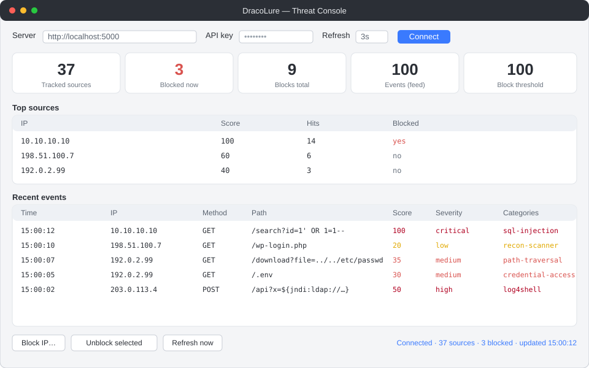

# 🖥️ DracoLure Desktop Console

A cross-platform GUI (Python **Tkinter**, standard library only) that connects
to a running DracoLure server and shows the live threat picture — summary
tiles, top sources, and a streaming events feed — with one-click quarantine
control.



## What it shows

- **Tiles** — tracked sources, blocked now, blocks total, feed size, block threshold.
- **Top sources** — the highest-scoring IPs with hit counts and block status.
- **Recent events** — the classified events feed, colour-coded by severity.
- **Actions** — block an IP, unblock the selected source, refresh on demand.

## Run

No install needed beyond Python 3.8+ with Tkinter (bundled on Windows/macOS;
`sudo apt install python3-tk` on Debian/Ubuntu):

```bash
python desktop/dracolure_console.py
python desktop/dracolure_console.py --url http://localhost:5000 --api-key YOUR_KEY
```

Or via environment variables:

```bash
DRACOLURE_URL=http://localhost:5000 DRACOLURE_API_KEY=… python desktop/dracolure_console.py
```

The console reuses the bundled [`integrations/python-sdk`](../integrations/python-sdk)
client when present, and falls back to a built-in `urllib` client otherwise, so
it runs straight from a checkout with no packaging step.

## Connecting

1. Enter the server URL (and API key if the server sets `DRACOLURE_API_KEY`).
2. Pick a refresh interval and click **Connect**.
3. Polling runs on a background thread, so the UI stays responsive even if the
   server or its database is briefly unreachable.
