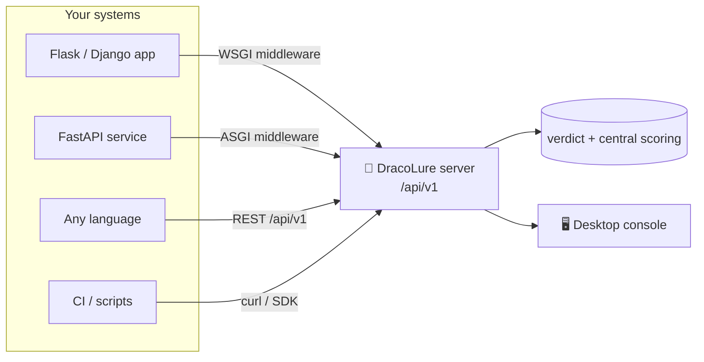

# 🔌 Integrating DracoLure

DracoLure runs as a central **detection service**. Your own apps and pipelines
report request metadata to it over a small REST API; DracoLure classifies each
one, scores it, tracks the source, and returns a verdict your app can act on.
There are four ways to plug in — pick whichever fits your stack.



---

## 1. 🧩 Injected middleware (recommended for web apps)

Add DracoLure to an existing app in **one line** — no code changes to your
routes. The middleware reports every request; in `block` mode it also rejects
sources DracoLure has quarantined.

```bash
pip install ./integrations/python-sdk
```

```python
from flask import Flask
from dracolure import DracoLureClient, DracoLureMiddleware

app = Flask(__name__)
client = DracoLureClient("http://dracolure:5000", api_key="…")   # api_key optional
app.wsgi_app = DracoLureMiddleware(app.wsgi_app, client, mode="monitor")
```

- `mode="monitor"` — fire-and-forget report, **zero added latency** (default).
- `mode="block"`  — waits for the verdict and returns `403` for quarantined sources.
- `fail_open=True` (default) — if DracoLure is unreachable, your app keeps serving.

Works with any WSGI app (Flask, Django, Pyramid, Bottle). FastAPI/ASGI: see
[`examples/fastapi_app.py`](examples/fastapi_app.py).

---

## 2. 🐍 SDK client (programmatic)

```python
from dracolure import DracoLureClient

c = DracoLureClient("http://localhost:5000")
verdict = c.ingest(method="GET", path="/x", query="id=1' OR 1=1--", source_ip="203.0.113.5")
print(verdict.recommendation, verdict.score, verdict.categories)
#   -> monitor 40 ['sql-injection']

c.block("203.0.113.5")          # quarantine a source
c.unblock("203.0.113.5")
print(c.stats())                # live snapshot
print(c.events(limit=20))       # recent classified events
```

The SDK is **standard-library only** (no dependencies) — safe to vendor anywhere.

---

## 3. 🌐 REST API (any language)

Base path: `POST/GET http://<host>:5000/api/v1`. If `DRACOLURE_API_KEY` is set
on the server, send it as the `X-API-Key` header.

| Method & path | Purpose |
|---------------|---------|
| `POST /api/v1/ingest` | Classify a reported request, get a verdict |
| `GET  /api/v1/stats` | Live tracker snapshot |
| `GET  /api/v1/events?limit=N&min_score=S` | Recent classified events |
| `POST /api/v1/block` `{ip, ttl_seconds?}` | Quarantine a source |
| `POST /api/v1/unblock` `{ip}` | Release a source |
| `GET  /api/v1/health` | Liveness + DB status |

See raw [`examples/curl.md`](examples/curl.md) and a JS client at
[`examples/node_client.js`](examples/node_client.js).

**Ingest verdict shape:**

```jsonc
{
  "source_ip": "203.0.113.5",
  "malicious": true,
  "score": 40,
  "severity": "medium",
  "categories": ["sql-injection"],
  "matches": { "sql-injection": "OR 1=1" },
  "blocked": false,
  "recommendation": "monitor"   // allow | monitor | block
}
```

---

## 4. 🐳 Docker

Run DracoLure as a shared service and point your app at it over the compose
network. See [`docker/docker-compose.integration.yml`](docker/docker-compose.integration.yml):

```bash
docker compose -f integrations/docker/docker-compose.integration.yml up -d
```

Your app container just needs `DRACOLURE_URL=http://dracolure:5000` and the SDK
installed — the middleware does the rest.

---

## 🖥️ Desktop console

A GUI to watch and control a running server lives in [`../desktop/`](../desktop/).

```bash
python desktop/dracolure_console.py --url http://localhost:5000
```
